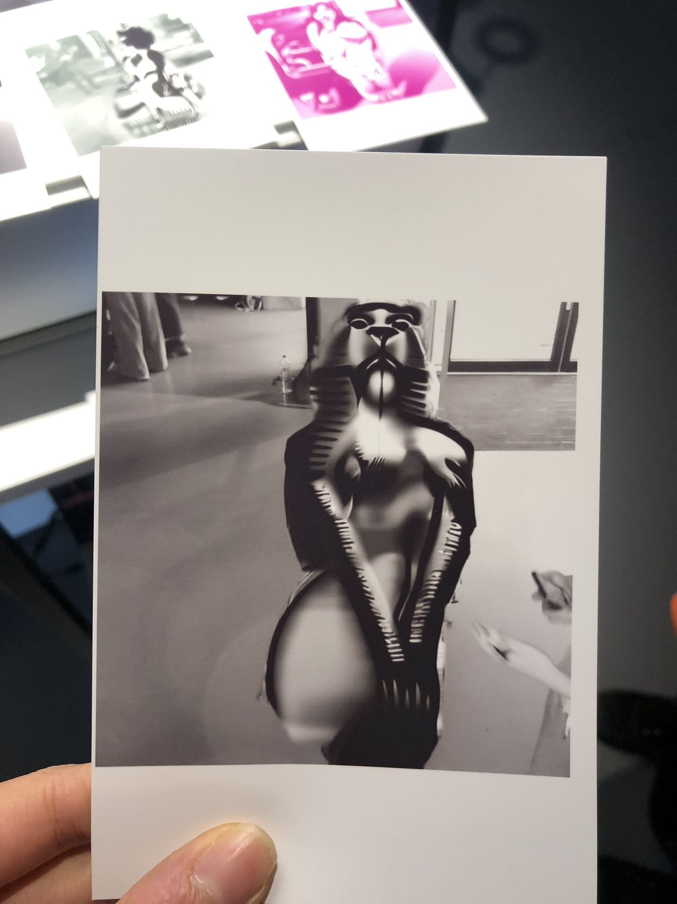

Qi Chen

# Project

## A Image Generation Model-based Art Intervention to Expose the Harm of Deepfake Pornography

# Abstract

The project is rooted in personal experience, stemming from an alarming encounter with a digital scam involving fabricated pornographic material. This incident not only underscores the widespread and psychologically damaging nature of such scams but also serves as a catalyst for the research. The thesis methodically explores the technical landscape of deepfake technology, including an analysis of Generative Adversarial Networks (GANs), CycleGAN, DeepNude, and Diffusion Models. This exploration provides a foundational understanding of the mechanisms behind the creation of deepfake content.

Central to the thesis is an innovative art installation that utilizes the Stable Diffusion model. This installation captures images of participants and artistically transforms them into nude lion representations, symbolizing strength and resilience. This artistic intervention is designed to engage viewers on an emotional level, fostering empathy for victims of deepfake abuse and stimulating a dialogue on the ethical dimensions of AI technology.

The installation's impact is multifaceted, eliciting reactions ranging from shock and empathy to reflection and discomfort among participants. These varied responses underscore the effectiveness of the project in raising awareness about the responsible use of AI and the pressing need for ethical considerations in technology deployment. The thesis concludes with the assertion that artistic interventions using image generation models can serve as a potent medium for addressing the societal implications of deepfake technology, thereby promoting critical discourse and awareness.

# Project Video

### [Youtube Link](https://youtu.be/XkdZirS28xk)

# Project Journal

### Please Refer to the [Link to pdf](./Final%20Journal.pdf) in the github folder

